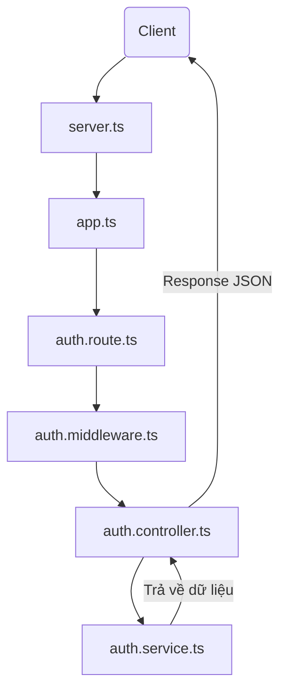

# Luồng đi của một Login Request trong `auth-api`

Dưới đây là sơ đồ và giải thích chi tiết về cách một yêu cầu đăng nhập (login request) được xử lý trong mã nguồn này.

## 1. Sơ đồ tổng quát



## 2. Chi tiết các bước xử lý

### Bước 1: Khởi tạo Server ([src/server.ts](file:///c:/Users/JettPham/source/repos/Login/auth-api/src/server.ts))
Khi bạn chạy ứng dụng, file này sẽ khởi động server Express trên cổng được cấu hình (mặc định là 5000) và bắt đầu lắng nghe các yêu cầu từ phía Client.

### Bước 2: Cấu hình Ứng dụng ([src/app.ts](file:///c:/Users/JettPham/source/repos/Login/auth-api/src/app.ts))
File này thiết lập các cấu hình cơ bản cho Express:
- **CORS**: Cho phép các yêu cầu từ các domain khác (nếu có).
- **JSON Parser**: `express.json()` giúp ứng dụng có thể đọc được dữ liệu gửi lên dưới dạng JSON trong `body` của request.

> [!NOTE]
> Hiện tại trong file [app.ts](file:///c:/Users/JettPham/source/repos/Login/auth-api/src/app.ts), route `/login` chưa được import và sử dụng. Để luồng này hoạt động, cần thêm `app.use('/auth', authRouter)`.

### Bước 3: Định tuyến (Routing - [src/routes/auth.route.ts](file:///c:/Users/JettPham/source/repos/Login/auth-api/src/routes/auth.route.ts))
Khi request `POST /login` đến, nó sẽ được khớp với định nghĩa trong file này:
```typescript
router.post('/login', authMiddleware, authController.login);
```

### Bước 4: Middleware ([src/middlewares/auth.middleware.ts](file:///c:/Users/JettPham/source/repos/Login/auth-api/src/middlewares/auth.middleware.ts))
Trước khi đến Controller, request đi qua [authMiddleware](file:///c:/Users/JettPham/source/repos/Login/auth-api/src/middlewares/auth.middleware.ts#3-8).
- **Chức năng hiện tại**: Đang đóng vai trò là một Logger, in ra console Method và Path của request.
- **Tiềm năng**: Đây là nơi để kiểm tra dữ liệu đầu vào hoặc xác thực token nếu cần.

### Bước 5: Controller ([src/controllers/auth.controller.ts](file:///c:/Users/JettPham/source/repos/Login/auth-api/src/controllers/auth.controller.ts))
Hàm [login](file:///c:/Users/JettPham/source/repos/Login/auth-api/src/controllers/auth.controller.ts#4-12) trong Controller sẽ tiếp nhận request:
- Lấy dữ liệu từ `req.body`.
- Gọi hàm [loginService](file:///c:/Users/JettPham/source/repos/Login/auth-api/src/services/auth.service.ts#1-5) từ tầng Service để xử lý logic.
- Sử dụng khối `try-catch` để bắt lỗi và trả về mã trạng thái HTTP phù hợp (200 nếu thành công, 400 nếu lỗi).

### Bước 6: Service ([src/services/auth.service.ts](file:///c:/Users/JettPham/source/repos/Login/auth-api/src/services/auth.service.ts))
Đây là nơi chứa logic nghiệp vụ thực sự:
- **Hiện tại**: Chỉ trả về một thông báo "Login successful" và email của user để giả lập.
- **Tương lai**: Sẽ thực hiện kiểm tra Database, so sánh mật khẩu và tạo JWT Token tại đây.

## 3. Tổng kết
Request đi từ ngoài vào trong theo mô hình phân tầng: **Route -> Middleware -> Controller -> Service**. Điều này giúp mã nguồn dễ bảo trì và mở rộng sau này.
